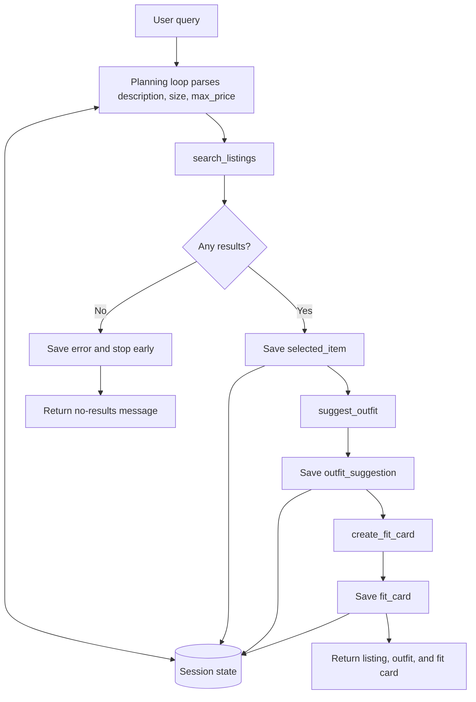

# FitFindr

FitFindr is a multi-tool AI agent that helps users find and style secondhand clothing from the starter repo's mock dataset. It does not search live marketplaces.

The app can:

- search mock secondhand clothing listings,
- choose the first/best ranked relevant item,
- style that selected item with the user's wardrobe,
- generate a short shareable outfit caption, or fit card.

The listings come from `data/listings.json`, and wardrobe data comes from `data/wardrobe_schema.json` through helper functions in `utils/data_loader.py`.

## How to Run the App

Install and run with `uv`:

```bash
uv run python app.py
```

The app launches locally with Gradio. The terminal shows a local URL, usually:

```text
http://127.0.0.1:7861
```
Run the tests with:

```bash
uv run pytest tests/
```

## Tool Inventory

### `search_listings(description, size, max_price)`

- Inputs:
  - `description` (`str`): item request such as `"vintage graphic tee"`.
  - `size` (`str | None`): optional size filter such as `"M"`, `"XL"`, or `None`.
  - `max_price` (`float | int | None`): optional price ceiling.
- Output: `list[dict]`
- Purpose: loads mock listings with `load_listings()`, filters by price and size, ranks by keyword relevance, and returns matching listing dictionaries.
- Failure behavior: returns an empty list when no listings match. It does not raise an exception for normal no-result searches.

### `suggest_outfit(new_item, wardrobe)`

- Inputs:
  - `new_item` (`dict`): selected listing dictionary.
  - `wardrobe` (`dict`): wardrobe dictionary with an `items` list.
- Output: `str`
- Purpose: suggests how to style the selected item with pieces from the user's wardrobe.
- Failure behavior:
  - If the wardrobe is empty, it returns general fallback styling advice and mentions limited wardrobe context.
  - If `new_item` is missing, it returns a clear message asking for a selected item instead of raising an exception.

### `create_fit_card(outfit, new_item)`

- Inputs:
  - `outfit` (`str`): outfit suggestion from `suggest_outfit()`.
  - `new_item` (`dict`): selected listing dictionary.
- Output: `str`
- Purpose: creates a short shareable outfit caption that mentions the selected item, source details, and styling vibe.
- Failure behavior:
  - If `outfit` is empty, it returns: `I need an outfit suggestion before I can create a fit card.`
  - If `new_item` is missing, it returns a clear selected-item error.
  - It does not pretend to create a valid caption when required inputs are missing.

## Planning Loop

`run_agent()` is the orchestration layer. It does not blindly call every tool every time. It branches based on whether each tool produced the state required by the next tool.

The flow is:

1. Receive the user query.
2. Parse the query into `description`, `size`, and `max_price`.
3. Load or receive wardrobe context.
4. Call `search_listings(description, size, max_price)`.
5. If no results are returned, save an error, stop early, and do not call `suggest_outfit()` or `create_fit_card()`.
6. If results exist, select the first ranked listing and save it as `selected_item`.
7. Call `suggest_outfit(selected_item, wardrobe)`.
8. Save the outfit suggestion.
9. Call `create_fit_card(outfit_suggestion, selected_item)`.
10. Save the final fit card.
11. Return the selected listing, outfit suggestion, and fit card.

## State Management

The agent passes information between tools through a session dictionary. Important keys include:

- `user_query`: original user request.
- `description`: parsed item description for search.
- `size`: parsed requested size or `None`.
- `max_price`: parsed price ceiling or `None`.
- `wardrobe`: selected wardrobe context.
- `search_results`: listings returned by `search_listings()`.
- `selected_item`: first ranked listing chosen for styling.
- `outfit_suggestion`: string returned by `suggest_outfit()`.
- `fit_card`: string returned by `create_fit_card()`.
- `error` / `error_message`: user-facing stop reason.
- `completed_steps`: observable tool-call trace.

State flows forward through the loop:

- `search_results` feeds into `selected_item`.
- `selected_item` feeds into `suggest_outfit()`.
- `outfit_suggestion` feeds into `create_fit_card()`.
- `completed_steps` shows which tools actually ran.

A successful run should show:

```python
["search_listings", "suggest_outfit", "create_fit_card"]
```

A no-results run should show:

```python
["search_listings"]
```

This trace is observable orchestration state, not hidden chain-of-thought.

## Architecture



## Error Handling

### Search returns no results

Example:

```python
search_listings("designer ballgown", size="XXS", max_price=5)
```

Expected output:

```python
[]
```

In the full agent, this stops after `search_listings`, saves a clear error message, and skips downstream tools.

Observed no-results session summary:

```python
completed_steps = ["search_listings"]
search_results = []
selected_item = None
outfit_suggestion = None
fit_card = None
```

### Empty wardrobe

`suggest_outfit()` handles `get_empty_wardrobe()` gracefully. It returns fallback styling advice instead of crashing, and the output mentions limited wardrobe context or no saved wardrobe items.

### Empty outfit string

Example:

```python
create_fit_card("", valid_item)
```

Expected behavior:

```text
I need an outfit suggestion before I can create a fit card.
```

### App error mapping

`handle_query()` maps a no-results agent response into user-facing text. When search fails, it does not fake outfit or fit-card content; those output panels remain empty.

## Testing

Run:

```bash
uv run pytest tests/
```

Latest result:

```text
14 passed
```

The tests cover:

- tool success paths,
- search no-results failure,
- price and size filtering,
- empty wardrobe fallback,
- empty outfit handling,
- planning loop success path,
- planning loop early stop,
- Gradio `handle_query()` output mapping.

## AI Tool Usage

I used AI to help implement the three required tools in `tools.py`, but I constrained it to preserve the starter function signatures and use `load_listings()` from `utils/data_loader.py`. I also checked whether the generated implementation matched the starter repo's expected return shape. Where an earlier draft described structured outputs but the starter tests expected simple list/string outputs, I followed the starter repo behavior so the implementation would remain compatible with the assignment grader.

I used AI to help wire `run_agent()` and `handle_query()`, but I did not accept the implementation just because it ran. I verified the actual session state and `completed_steps` trace. I checked that a successful query produced:

```python
["search_listings", "suggest_outfit", "create_fit_card"]
```

while the impossible no-results query stopped after:

```python
["search_listings"]
```

This confirmed the agent was branching based on tool output instead of blindly calling every tool.


## Demo Video

https://www.loom.com/share/9fa7b102383b43c795d284bfb38cfaf8
