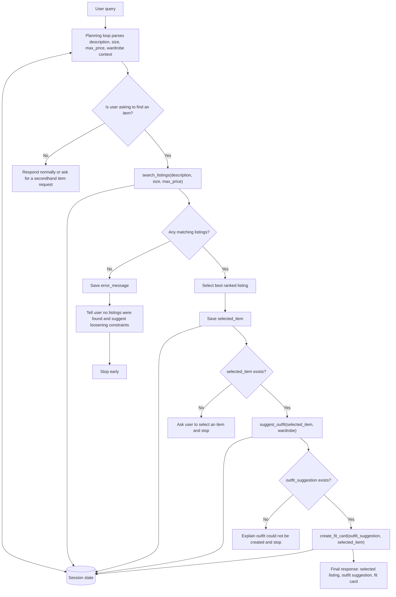

# FitFindr - planning.md

> Complete this document before writing any implementation code.
> Your spec and agent diagram are what you'll use to direct AI tools (Claude, Copilot, etc.) to generate your implementation - the more specific they are, the more useful the generated code will be.
> Your planning.md will be reviewed as part of your submission.
> Update it before starting any stretch features.

---

## Tools

List every tool your agent will use. For each tool, fill in all four fields.
You must have at least 3 tools. The three required tools are listed below.

### Tool 1: search_listings

**What it does:**
Searches the mock secondhand listings dataset for items that match the user's requested item description, optional size, and optional maximum price. It should use `load_listings()` from `utils/data_loader.py` and rank/filter against listing fields rather than re-reading JSON directly.

**Input parameters:**
- `description` (str): Natural language item request, such as `"vintage graphic tee"`, `"black leather jacket"`, or `"platform sneakers"`.
- `size` (str or null): Requested size, such as `"M"`, `"L"`, `"US 8"`, `"W30"`, or `null` when the user did not provide a size.
- `max_price` (float, int, or null): Maximum price the user wants to pay, such as `30.0`, or `null` when the user did not provide a budget.

**What it returns:**
A dictionary with this structure:

- `success` (bool): `true` when one or more listings match; otherwise `false`.
- `items` (list[dict]): Matching listing dictionaries from `data/listings.json`. Each item includes `id`, `title`, `description`, `category`, `style_tags`, `size`, `condition`, `price`, `colors`, `brand`, and `platform`.
- `message` (str): User-facing summary of the search result, including what matched or why no match was found.
- `error` (str or null): `null` on success; an explanation such as `"no_matches"` or `"invalid_description"` on failure.

Filtering and matching rules:

- If `max_price` is provided, only return listings where `price <= max_price`.
- If `size` is provided, prefer exact or close text matches against the listing `size` field.
- Use `title`, `description`, `category`, `style_tags`, `colors`, and `brand` for text relevance.
- Rank stronger text matches higher, then prefer items that satisfy size and price cleanly.

Success means the tool returns at least one relevant listing. Failure means no listings match after applying constraints, or the input description is empty/unusable.

**What happens if it fails or returns nothing:**
The agent should save the error in session state, tell the user no listings were found, name the likely narrow constraint such as size, description, or price, and stop before calling `suggest_outfit` or `create_fit_card`. The agent can ask the user to loosen constraints, for example by increasing max price or trying a broader description.

---

### Tool 2: suggest_outfit

**What it does:**
Suggests how to style one selected listing with the user's existing wardrobe. It should use the selected item's category, colors, and style tags, then choose compatible wardrobe pieces by category, color harmony, style overlap, and notes.

**Input parameters:**
- `new_item` (dict): One selected listing returned by `search_listings`. It should include at least `title`, `category`, `colors`, `style_tags`, `price`, and `platform`.
- `wardrobe` (dict): Wardrobe object from `get_example_wardrobe()` or `get_empty_wardrobe()`, with an `items` list.

**What it returns:**
A dictionary with this structure:

- `success` (bool): `true` when a usable outfit suggestion is produced; otherwise `false`.
- `outfit` (dict or null): Suggested outfit details, or `null` on hard failure. A successful outfit should include the `new_item`, selected wardrobe pieces when available, and a short styling rationale.
- `message` (str): User-facing outfit suggestion.
- `error` (str or null): `null` on success; an explanation such as `"missing_new_item"` on failure.

Success means the tool creates a usable outfit suggestion using at least the new item and one wardrobe item when possible. If the wardrobe is empty or minimal, success can still be `true` if the tool gives fallback styling advice and clearly says it had limited wardrobe context.

**What happens if it fails or returns nothing:**
If `new_item` is missing or unusable, the agent should stop and ask the user to select an item first. If the wardrobe is empty, the agent should use fallback styling advice rather than stopping, then continue to `create_fit_card` only if an outfit suggestion exists.

---

### Tool 3: create_fit_card

**What it does:**
Creates a short shareable outfit caption from the selected listing and outfit suggestion. The caption should feel like an Instagram outfit post and mention the new item, price or platform when available, and styling vibe.

**Input parameters:**
- `outfit` (dict or str): The outfit suggestion produced by `suggest_outfit`.
- `new_item` (dict): The selected listing returned by `search_listings`.

**What it returns:**
A dictionary with this structure:

- `success` (bool): `true` when a caption is produced; otherwise `false`.
- `fit_card` (str or null): Short shareable caption, or `null` on failure.
- `message` (str): User-facing final response or explanation.
- `error` (str or null): `null` on success; an explanation such as `"missing_outfit"` or `"missing_new_item"` on failure.

Success means the tool produces a caption based on the selected item and outfit suggestion. Failure means `outfit` or `new_item` is missing, empty, or unusable.

**What happens if it fails or returns nothing:**
The agent should explain that it needs a selected item and outfit suggestion before it can create a fit card. It should not invent missing item details; it should ask the user to pick an item or rerun the outfit step.

---

### Additional Tools (if any)

No additional tools are planned for the required milestone flow. The agent should rely on `search_listings`, `suggest_outfit`, and `create_fit_card`.

---

## Planning Loop

**How does your agent decide which tool to call next?**

The agent should use session state to decide whether the next tool has the inputs it needs. It should not blindly call all tools in a fixed sequence.

1. Receive the user query and save it as `user_query`.
2. Parse or infer `description`, `size`, and `max_price` from the query. If the user does not provide `size`, store `null`; if the user does not provide `max_price`, store `null`.
3. Load or receive wardrobe context and save it as `wardrobe`. During early testing this can come from `get_example_wardrobe()` or `get_empty_wardrobe()`.
4. If the user is asking to find a secondhand item, call `search_listings(description, size, max_price)`.
5. Save the returned `items` as `search_results` and record `"search_listings"` in `completed_steps`.
6. If `search_listings.success` is `false` or `items` is empty, save `error_message`, tell the user no listings were found, suggest loosening size, description, or price constraints, and stop.
7. If listings are found, select the best item by relevance and price match, or use the first ranked result. Save it as `selected_item`.
8. Only if `selected_item` exists, call `suggest_outfit(selected_item, wardrobe)`.
9. Save the returned outfit as `outfit_suggestion` and record `"suggest_outfit"` in `completed_steps`.
10. If `suggest_outfit` fails because `selected_item` is missing, save `error_message`, ask the user to select an item, and stop.
11. If the wardrobe is empty, allow fallback styling advice if the tool returns a successful outfit suggestion with limited wardrobe context.
12. Only if `outfit_suggestion` exists, call `create_fit_card(outfit_suggestion, selected_item)`.
13. Save the returned caption as `fit_card` and record `"create_fit_card"` in `completed_steps`.
14. Return a final response containing the selected listing, the outfit suggestion, and the fit card.

The loop is complete when it has either returned a final response with a selected listing, outfit, and fit card, or stopped early with a clear user-facing error message.

---

## State Management

**How does information from one tool get passed to the next?**

The agent should keep a session state dictionary for the current interaction. Each tool reads only the state it needs and writes back structured results for later steps.

| State key | Type | Purpose |
|-----------|------|---------|
| `user_query` | str | Original user request. |
| `description` | str or null | Parsed item description used by `search_listings`. |
| `size` | str or null | Parsed requested size; `null` means no size filter. |
| `max_price` | float/int or null | Parsed price ceiling; `null` means no price filter. |
| `wardrobe` | dict | User wardrobe object with an `items` list. |
| `search_results` | list[dict] | Listings returned by `search_listings`. |
| `selected_item` | dict or null | The listing chosen for styling. |
| `outfit_suggestion` | dict, str, or null | Output from `suggest_outfit`. |
| `fit_card` | str or null | Caption output from `create_fit_card`. |
| `error_message` | str or null | Current blocking error or user-facing failure explanation. |
| `completed_steps` | list[str] | Tool names that completed successfully or intentionally with fallback. |

Data flow:

- `user_query` is parsed into `description`, `size`, and `max_price`.
- `description`, `size`, and `max_price` are passed into `search_listings`.
- `search_results` is used to choose `selected_item`.
- `selected_item` and `wardrobe` are passed into `suggest_outfit`.
- `outfit_suggestion` and `selected_item` are passed into `create_fit_card`.
- `fit_card`, `outfit_suggestion`, and `selected_item` are combined into the final response.
- If any required state is missing, the agent should stop or use the documented fallback instead of continuing with invalid inputs.

---

## Error Handling

For each tool, describe the specific failure mode you're handling and what the agent does in response.

| Tool or step | Failure mode | Cause | Tool return | Agent response | Stop, retry, or fallback |
|--------------|--------------|-------|-------------|----------------|--------------------------|
| search_listings | No results match the query | Description, size, or max price is too narrow for the 40 mock listings. | `success: false`, `items: []`, `message` explaining no matches, `error: "no_matches"` | Tell the user no listings were found and suggest broadening the description, removing size, or increasing max price. | Stop before `suggest_outfit` and `create_fit_card`. |
| search_listings | User gives no size | Size was not included in the user query. | `success: true` if description/price matches exist, with `size` treated as `null`. | Mention that results were not filtered by size if relevant. | Continue; no retry needed. |
| search_listings | User gives no max price | Budget was not included in the user query. | `success: true` if description/size matches exist, with `max_price` treated as `null`. | Mention that results were not filtered by price if relevant. | Continue; no retry needed. |
| search_listings | Inputs are unusable | Description is empty or unrelated to finding an item. | `success: false`, `items: []`, `message` asking for an item description, `error: "invalid_description"` | Ask the user what kind of item they want to find. | Stop until user provides a clearer request. |
| suggest_outfit | Wardrobe is empty | `wardrobe["items"]` is empty, such as from `get_empty_wardrobe()`. | Prefer `success: true` with fallback outfit advice and `error: null`; if impossible, `success: false`, `outfit: null`, `error: "empty_wardrobe"`. | Say wardrobe context is limited and style the new item with general advice. | Fallback if possible; continue only if an outfit exists. |
| suggest_outfit | Selected item is missing | `selected_item` was not saved because search failed or no item was chosen. | `success: false`, `outfit: null`, `message` asking for a selected item, `error: "missing_new_item"`. | Ask the user to select a listing first. | Stop. |
| create_fit_card | Outfit suggestion is missing | `suggest_outfit` failed or was skipped. | `success: false`, `fit_card: null`, `message` explaining an outfit is required, `error: "missing_outfit"`. | Explain that a fit card needs an outfit suggestion first. | Stop. |
| create_fit_card | New item is missing | Selected listing is missing or malformed. | `success: false`, `fit_card: null`, `message` explaining a selected listing is required, `error: "missing_new_item"`. | Ask the user to choose a listing before creating the caption. | Stop. |
| LLM/API call | Groq call fails or times out later | Network issue, invalid API key, rate limit, or model timeout. | Structured failure with `success: false`, relevant output field set to `null`, and `error` such as `"llm_timeout"` or `"llm_api_error"`. | Apologize briefly, explain that the generation step failed, and keep prior successful state so the user can retry. | Retry once if safe; otherwise stop with a clear message. |

---

## Architecture



---

## AI Tool Plan

For each implementation milestone, I will use Codex with the specific planning sections below instead of asking it to generate a whole agent from a vague prompt.

**Milestone 3 - Individual tool implementations:**

- For implementing `search_listings`, I will give Codex the Tool 1 specification, listings data fields, and `utils/data_loader.py` helper details. I expect Codex to implement filtering with `load_listings()` and return the documented `success`, `items`, `message`, and `error` structure. I will verify it by testing matching queries, size filtering, price filtering, combined constraints, and no-result behavior.
- For implementing `suggest_outfit`, I will give Codex the Tool 2 specification, wardrobe schema, and `selected_item` state contract. I expect Codex to implement category-aware and style-aware outfit selection using wardrobe `category`, `colors`, `style_tags`, and `notes`. I will verify it with `get_example_wardrobe()` and `get_empty_wardrobe()` to confirm both normal and fallback behavior.
- For implementing `create_fit_card`, I will give Codex the Tool 3 specification and expected caption behavior. I expect Codex to produce short captions that mention the new item, price or platform when available, and the styling vibe. I will verify that different inputs produce different captions and that missing `outfit` or `new_item` inputs return structured failures.

**Milestone 4 - Planning loop and state management:**

- For implementing the planning loop, I will give Codex the Architecture diagram, Planning Loop section, and State Management section. I expect Codex to implement state transitions that only call downstream tools when the previous tool produced the required state. I will verify that the agent does not call `suggest_outfit` or `create_fit_card` when `search_listings` fails, and that successful runs return the selected listing, outfit suggestion, and fit card.

---

## A Complete Interaction (Step by Step)

FitFindr should help the user find a secondhand item, style it with pieces they already own, and turn the result into a short shareable fit caption. When the user asks for an item with constraints like description, size, or max price, the agent should call `search_listings`; after the user or agent selects a candidate item, it should call `suggest_outfit` with that item and the user's wardrobe; after an outfit is suggested, it should call `create_fit_card` to generate the caption. If `search_listings` finds no matches, the agent should explain what constraint likely blocked the search and stop or ask the user to loosen the constraints instead of calling `suggest_outfit` or `create_fit_card`.

Write out what a full user interaction looks like from start to finish - tool call by tool call. Use a specific example query.

**Example user query:** "I'm looking for a vintage graphic tee in size M under $30. I mostly wear baggy jeans and chunky sneakers. What's out there and how would I style it?"

**Step 1:**
The agent parses the query and saves:

- `user_query`: `"I'm looking for a vintage graphic tee in size M under $30. I mostly wear baggy jeans and chunky sneakers. What's out there and how would I style it?"`
- `description`: `"vintage graphic tee"`
- `size`: `"M"`
- `max_price`: `30.0`
- `wardrobe`: the user's wardrobe, using `get_example_wardrobe()` during starter testing.

For user queries where no size is provided, the agent should store `size` as `null` and search without a size filter.

First tool call:

```text
search_listings(description="vintage graphic tee", size="M", max_price=30.0)
```

**Step 2:**
`search_listings` filters listings priced at or below `$30`, applies the size `"M"` constraint, and ranks text matches for `"vintage graphic tee"` using title, description, category, style tags, colors, and brand. Because the query asks for size M, the walkthrough should not treat size L tee listings as matches unless the agent intentionally asks the user to loosen the size constraint. A realistic compatible returned listing is:

- `lst_002`: `"Y2K Baby Tee - Butterfly Print"`, size `S/M`, price `$18.00`, platform `depop`. This is compatible with a size M query because the listing size explicitly includes `M`, and its title/description/style tags include tee, graphic, vintage, and Y2K signals.

The agent saves this as `search_results`, selects the best ranked result, and saves it as `selected_item`. For this walkthrough, `selected_item` is `lst_002`.

Second tool call:

```text
suggest_outfit(new_item=selected_item, wardrobe=wardrobe)
```

**Step 3:**
`suggest_outfit` uses the selected tee's category, white/pink/purple colors, and style tags such as `y2k`, `vintage`, `graphic tee`, and `cottagecore`. With the example wardrobe, it can pair the tee with baggy dark-wash jeans, chunky white sneakers, and the black crossbody bag. The agent saves this result as `outfit_suggestion`.

Third tool call:

```text
create_fit_card(outfit=outfit_suggestion, new_item=selected_item)
```

`create_fit_card` creates a short caption that mentions the selected listing, its price or platform, and the styling vibe. The agent saves the caption as `fit_card`.

**Error path if search returns no matches:**

If `search_listings("vintage graphic tee", "M", 30.0)` returns `success: false` and `items: []`, the agent saves `error_message`, tells the user no matching size M tees were found under `$30`, suggests loosening the size, description, or price constraint, and stops without calling `suggest_outfit` or `create_fit_card`.

**Final output to user:**
The user sees one concise response with:

- Selected listing: `"Y2K Baby Tee - Butterfly Print"` from `depop`, size `S/M`, `$18.00`, condition `excellent`.
- Outfit suggestion: Wear it with baggy dark-wash jeans, chunky white sneakers, and a black crossbody bag for a Y2K vintage look.
- Fit card caption: `"Depop find: an $18 butterfly baby tee styled with baggy denim, chunky sneakers, and a black crossbody - soft Y2K vintage energy."`
